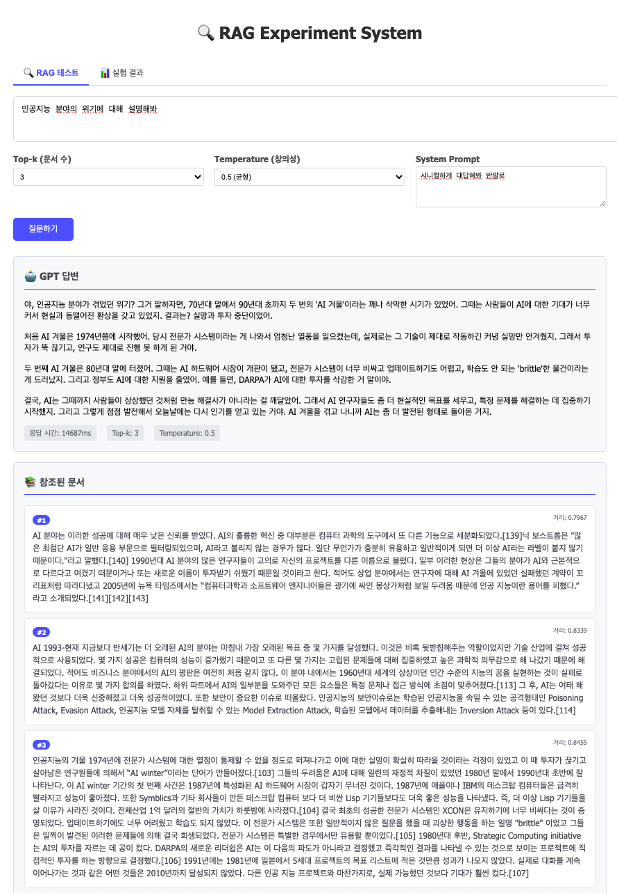
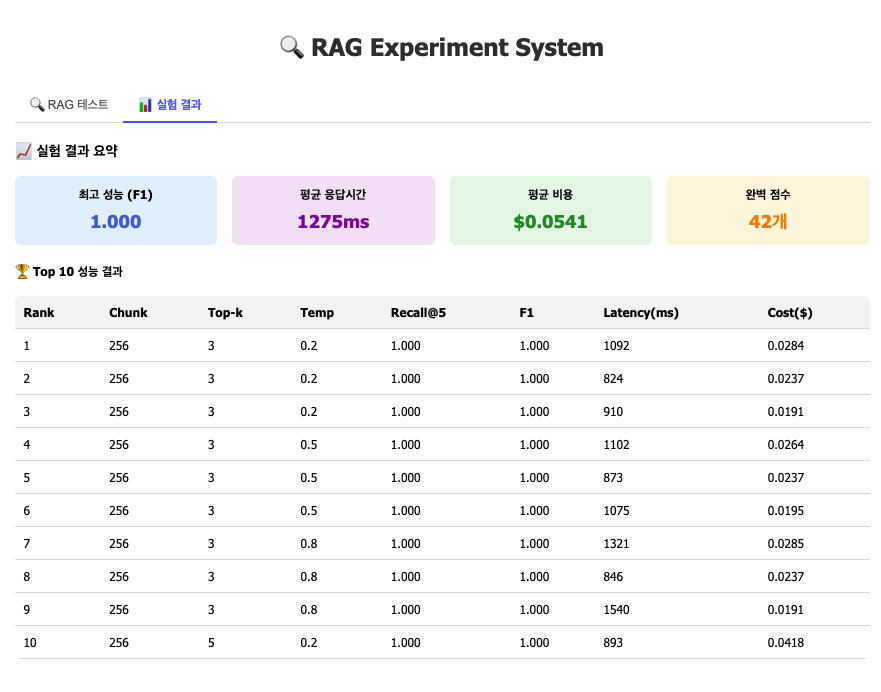

# RAG Experiment Automation System v0.1

> **Retrieval-Augmented Generation (RAG) 시스템의 파라미터 최적화를 위한 자동화된 실험 프레임워크**

FastAPI 기반의 RAG 시스템에서 chunking, top-k, temperature 파라미터의 성능을 체계적으로 분석하고 최적화하는 도구입니다. Grid Search를 통해 다양한 파라미터 조합을 자동으로 테스트하고, 웹 인터페이스에서 실시간으로 결과를 확인하며 최적의 설정을 찾을 수 있습니다.

---

## 🚀 빠른 시작 (Quick Start)

### 🌐 웹 인터페이스 기능
- **실시간 질문-답변**: 브라우저에서 직접 RAG 시스템 테스트
- **파라미터 조절**: Top-k, Temperature, System Prompt 실시간 변경
- **결과 시각화**: GPT 답변과 참조 문서 동시 표시
- **동적 실험 결과**: 최신 실험 결과 요약 및 Top 10 성능 조합 자동 로딩

### 📸 실제 작동 예시


*실시간 테스트 화면 예시*


*동적으로 로딩되는 실험 결과 화면 예시*

> 🔗 **실시간 데모**: [https://gpt-fastapi-app.onrender.com/](https://gpt-fastapi-app.onrender.com/)

### 환경 설정

1. **환경 변수 설정**
   ```bash
   # .env 파일 생성
   cp .env.example .env
   
   # .env 파일을 편집하여 실제 API 키 입력
   # OPENAI_API_KEY=sk-your_actual_api_key_here
   ```

2. **OpenAI API 키 발급**
   - [OpenAI Platform](https://platform.openai.com/api-keys)에서 API 키 발급
   - `.env` 파일에 `OPENAI_API_KEY=sk-...` 형태로 입력

### 로컬 실행
```bash
# 1. 의존성 설치
pip install -r requirements.txt

# 2. 서버 실행
python main.py

# 3. 웹 인터페이스 접속
# 브라우저에서 http://localhost:8000 주소로 접속
```

### 새로운 기능: 텍스트 직접 입력
- **📝 텍스트 입력 탭**: 파일 업로드 없이 직접 텍스트 입력
- **실시간 글자 수 카운터**: 입력 중인 텍스트의 길이 표시
- **향상된 검증**: 제목 길이, 텍스트 크기 제한
- **알림 시스템**: 성공/에러/경고 메시지 표시

---

## 🔬 실험 자동화 흐름

### 1. Grid Search 실행
`experiments/grid_run.py` 파일을 직접 실행하여 그리드 서치를 수행합니다.
```bash
python -m experiments.grid_run
```
- **파라미터 조합** 자동 테스트 (chunk size, top-k, temperature)
- 결과는 `experiments/results/` 폴더에 `grid_search_YYYYMMDD_HHMMSS.csv` 형태로 저장됩니다.

### 2. 결과 확인
서버 실행 후 웹 인터페이스의 '실험 결과' 탭에서 최신 실험 결과를 동적으로 확인할 수 있습니다.

---

## 📁 프로젝트 구조

```
gpt-fastapi-app/
├── main.py                    # FastAPI RAG 서버 (API 로직)
├── config.py                  # 프로젝트 설정 관리
├── requirements.txt           # 파이썬 의존성 목록
├── .env.example               # 환경 변수 예시 파일
├── prompt_template.py         # 프롬프트 템플릿
├── static/
│   └── index.html             # 프론트엔드 UI
├── experiments/
│   ├── grid_run.py            # 그리드 서치 실행 스크립트
│   ├── analyze_results.py     # (참고용) 결과 분석 스크립트
│   └── results/               # 실험 결과 CSV 저장 폴더
│       └── *.csv
├── utils/
│   └── data_loader.py         # 데이터 로더 유틸
├── data/
│   ├── index.faiss            # Faiss 벡터 인덱스
│   └── text_chunks.txt        # 원본 텍스트 데이터
└── logs/                      # 대화 로그 저장 폴더
```

---

## 🛠️ 기술 스택

- **Backend**: FastAPI, Python 3.8+
- **AI/ML**: OpenAI GPT-4, text-embedding-3-small
- **Vector Search**: Faiss (Facebook AI Similarity Search)
- **Data Processing**: Pandas, NumPy
- **Frontend**: HTML, CSS, JavaScript (Vanilla)

---

## 🤝 기여하기

언제나 환영합니다. 이슈를 등록하거나 Pull Request를 보내주세요.

1.  Repository를 Fork합니다.
2.  새로운 기능 브랜치를 생성합니다. (`git checkout -b feature/amazing-feature`)
3.  변경 사항을 커밋합니다. (`git commit -m 'Add amazing feature'`)
4.  브랜치에 푸시합니다. (`git push origin feature/amazing-feature`)
5.  Pull Request를 생성합니다.

---

## 📄 라이선스

이 프로젝트는 MIT 라이선스를 따릅니다. 자세한 내용은 `LICENSE` 파일을 참고하세요.
